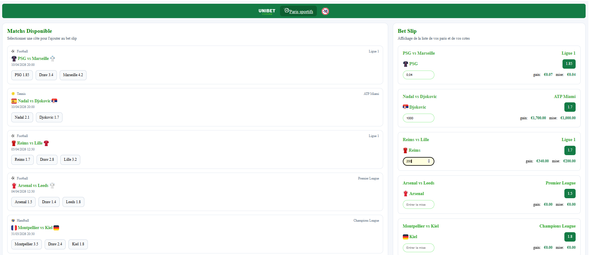

# SportsBookApp


This project was generated using [Angular CLI](https://github.com/angular/angular-cli) version 21.1.4.

## Overview

SportsBookApp is a small sports betting application built with Angular as part of a technical test.

The application displays a list of sports matches with their odds.  
Users can select odds, manage a bet slip, enter a stake, and see the potential gain for each bet.

---

## Application preview



# Features

### Match list

- Display a list of sports matches from mock data
- Display available odds for each match
- Select one odd per match
- Replace the selected odd for the same match
- Remove a selected odd by clicking it again

### Bet Slip

The Bet Slip displays the list of selected bets.

For each selected bet, the application displays:

- the selected team
- the odd value
- the stake entered by the user
- the calculated potential gain

Users can enter a stake  using a numeric input.

### Stake (mise) validation

To prevent unrealistic bets, the stake input includes a limit:

- Maximum stake allowed: **999,999**
- If the user attempts to exceed this limit, the value is automatically replaced by the MAX
- An error message inform the user when the limit is reached

The  gain is calculated each time the stake change.

---

# Tech stack

- Angular
- TypeScript
- SCSS
- RxJS
- Angular standalone components
- Jest (unit testing)
- npm 10.8.2

---

# Architecture

The application is split into dedicated components:

### MatchService
Service to retrieve the mock of matchs

### MainLayoutComponent
Handles the global page layout

### MatchListComponent
Displays matches and odds

### BetSlipComponent
Displays selected bets, the stake input, and potential gains

### BetSlipService
Centralizes the bet slip state and updates selections

Selections are stored using a structure keyed by **matchId** to ensure that only one odd can be selected per match

---

# Running the project

Clone the repository and install dependencies:
```bash
git clone https://gitlab.devolab.cloud/bama.anne-marie.abougou/fdj-sportbook.git
npm install
npm start or ng serve
```
Once the server is running, open the browser and navigate to: http://localhost:4200/

Unit tests are written using Jest, to run the tests :
```bash
npm test
```

If you want to see the coverage you can launch the following command, 
then you will have access to a repertory sportsBookApp\coverage\lcov-report and you can open the index.html file
to see the unit tests.

```bash
npm test -- --coverage
```
## Author
Bama Abougou  
Devoteam

